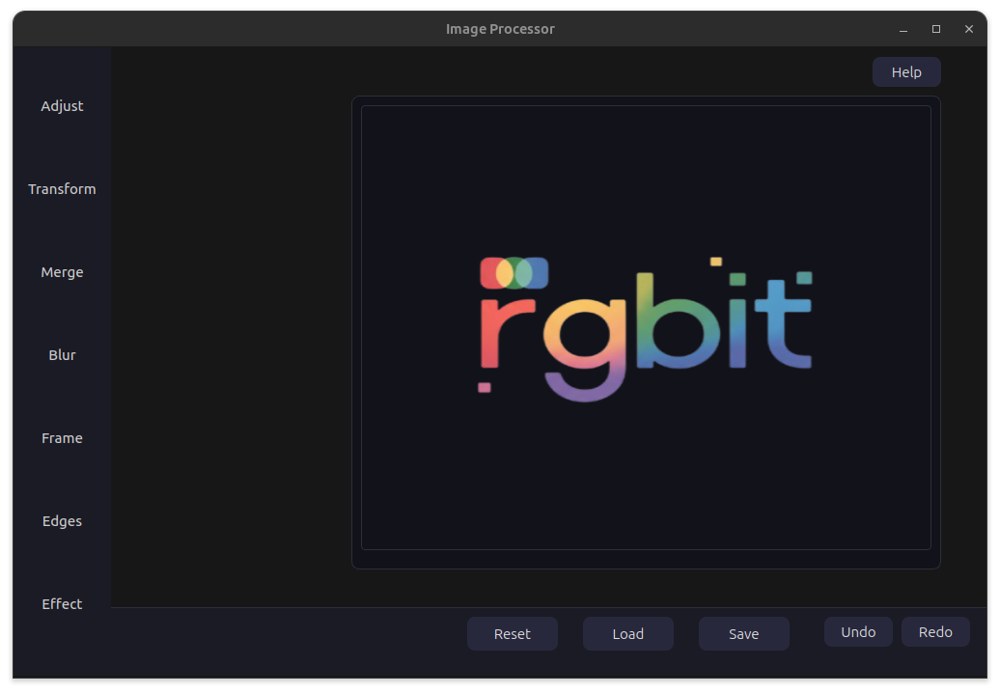

# RGBit

RGBit is a Comprehensive image processor desktop application with **24** filters built using **C++ and the Qt Framework**, featuring tools for effects, blurring, and image transformations, and color adjustments.

---

--
## Features

### Core Image Processing

* **Color Filters (with live preview)**

  * Brightness with slider range [-100,100]
  * Temperature with slider range [-100,100]
  * Contrast with slider range [-100,100]
  * Black & White
  * Gray
* **Effect Filters**
  * Oil Painting
  * Sunlight
  * Moonlight
  * Purple
  * Invert
  * Infrared
  * Burn
  * Emboss
  * Swirl
  * Old TV Filter
* **Transformation Filters**
  * Skew with slider range [-89,89]
  * Rotate (90°, 180°, 270°)
  * Flip (Horizontal / Vertical)
  * Rubber Crop
  * Resize
* **Guassian Blur Filter**
* **Merge**
* Edges Detector
* **Add Frame (solid,dotted,dashed)**

### Image display & control
* Undo/Redo Support
* Reset Image
* Load & Save Image
* Help dialog for command guidance
* “Hold-press to view original” shortcut

---

## User Interface

* Built using **Qt Widgets** (`.ui` file designed in Qt Designer)
* Sidebar panel for **image properties** (appears when clicking “Properties” button)
* Central preview area for **original** and **filtered** images using `QLabel`
* Supports **loading and saving** images in `.png`, `.jpg`, `.jpeg`, and `.bmp` formats
* Animated sidebar for smoother transitions between editing tools
* Keyboard shortcuts for quick actions

---

## Performance Optimization

- Blur filter: The Blur filter in this project is optimized using multithreading to leverage multi-core CPU architectures.
  Instead of processing the entire image sequentially, the algorithm divides the image into segments, and each thread handles a separate region in parallel.

---

## Project Structure

```
ImageProcessor/
├── include/
│   └── mainwindow.h          # GUI logic and event handlers
│   └── imageview.h           # Image displaying and Rubber crop
│   └── stb_image.h           # This is a helper library handed through the assignment
│   └── stb_image_write.h     # This is a helper library handed through the assignment
│   ├── Image_Class.h         # Image class handling raw pixel data & Filter prototypes (This file is helper interface for stb library, but we add filters)

├── src/
│   ├── main.cpp              # Application entry point
│   ├── mainwindow.cpp        # UI event handlers and image operations
│   ├── Image_Filters.cpp     # Filters implementation 
│   ├── imageview.cpp         # Image displayer and Rubber crop implementation
├── ui/
│   └── mainwindow.ui         # Designed Qt interface
├── Images (assets)/
│   └── oldtv.jpg            
├── CMakeLists.txt            # CMake build configuration
└── README.md                 # Project documentation
```

---

## Installation & Setup

### Prerequisites

Before building, ensure the following dependencies are installed:

#### On Linux (Ubuntu / Debian)

```bash
sudo apt update
sudo apt install build-essential cmake qtbase5-dev qtchooser qt5-qmake qtbase5-dev-tools
```

For Qt 6:

```bash
sudo apt install qt6-base-dev qt6-base-dev-tools
```

#### On Windows

* Install [Qt](https://www.qt.io/download-open-source) and select the **Qt 6.x (MinGW)** or **Qt 5.x** package.
* Ensure **CMake** and **MinGW** are added to your system PATH.

#### On macOS

```bash
brew install cmake qt
```

---

### Building with CMake

```bash
git clone https://github.com/<your-username>/Qt-ImageProcessor.git
cd Qt-ImageProcessor
mkdir build && cd build
cmake ..
make
./ImageProcessor
```

If `cmake` cannot find Qt, specify its installation path:

```bash
cmake -DCMAKE_PREFIX_PATH=/path/to/Qt/6.x/gcc_64 ..
```

---

### Building in CLion or Qt Creator

#### In CLion

1. Open the project folder in **CLion**.
2. Navigate to **File → Settings → Build, Execution, Deployment → CMake**.
3. Click **+** to add a new CMake profile (for example, `Debug`).
4. Press **Reload CMake Project**.
5. Click **Build → Build Project** or press `Ctrl + F9` to compile.

#### In Qt Creator

1. Open the `CMakeLists.txt` file.
2. Configure the project using your preferred **Qt Kit**.
3. Build and run the application directly.

---

### Troubleshooting

If you get this message:

```
Cannot find any CMake profile
```

Go to **Settings → Build, Execution, Deployment → CMake**, and create a new profile (e.g., `Debug`).

If you see:

```
Could not find Qt6::Widgets
```

Run:

```bash
cmake -DCMAKE_PREFIX_PATH=/path/to/Qt/6.x/gcc_64 ..
```

---

## Authors

- [Abdelhamid Ahmed Abdelhamid ElRashidy](https://github.com/Abdelhamid-El-rashidy)
- [Hazem Mahmoud Mohammed](https://github.com/Hazem225)
- [Anas Ibrahem Hesham Ali](https://github.com/anas012201)
---

## Acknowledgments

- Dr. Mohamed El-Ramely — Course Instructor 
- Original Image_Class base by Shehab Diab, Youssef Mohamed, and Nada Ahmed 
- stb_image / stb_image_write libraries provided through the assignment
---

## Links

* **Project Report:** [Google Document Link](https://docs.google.com/document/d/1uPoAtI0X4FZSFgmnABq6FTRaYfOWz46X1Rf8pQi4_94/edit?tab=t.0)
* **Demo Video:** [Google Drive Link](https://drive.google.com/drive/folders/1oabwI5nQSOdJEY3tQPBP4ow-7c4mLNsm?usp=drive_link)

---

## License

This project is licensed under the **MIT License** — free for personal, educational, and academic use.